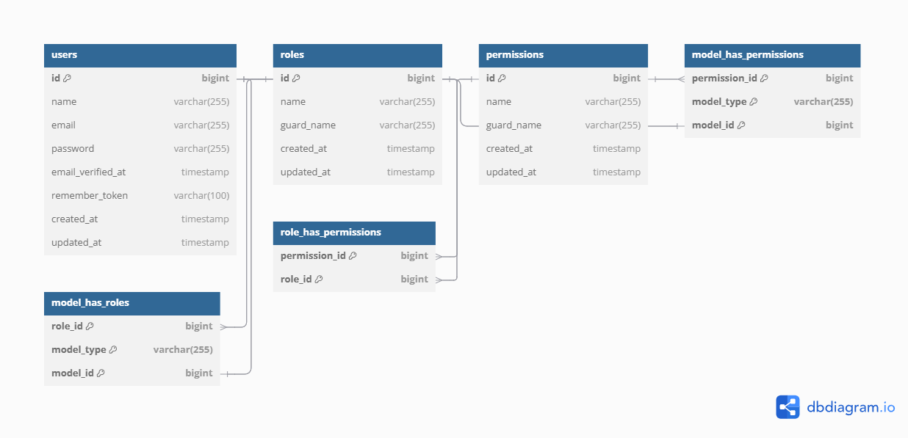

# Modelo de Base de Datos - Task Master E-commerce

## Visión General

Este documento detalla el modelo de datos para la plataforma Task Master E-commerce, siguiendo un enfoque relacional optimizado para comercio electrónico.

## Diagrama ER

*Nota: Para crear o actualizar este diagrama:*
1. *Utilizar [dbdiagram.io](https://dbdiagram.io/) o [draw.io](https://app.diagrams.net/)*
2. *Exportar como PNG o SVG*
3. *Guardar en la carpeta `docs/images/`*
4. *Actualizar este documento si hay cambios en el modelo*

## Entidades Principales

### Users (Usuarios)
| Campo | Tipo | Descripción |
|-------|------|-------------|
| id | bigint | Identificador único |
| name | varchar(255) | Nombre completo |
| email | varchar(255) | Email (único) |
| password | varchar(255) | Contraseña hasheada |
| role_id | bigint | Referencia a roles |
| email_verified_at | timestamp | Verificación de email |
| remember_token | varchar(100) | Token para "recordarme" |
| created_at | timestamp | Fecha de creación |
| updated_at | timestamp | Fecha de actualización |

### Roles (Roles)
| Campo | Tipo | Descripción |
|-------|------|-------------|
| id | bigint | Identificador único |
| name | varchar(255) | Nombre del rol (admin, customer, etc.) |
| created_at | timestamp | Fecha de creación |
| updated_at | timestamp | Fecha de actualización |

### Permissions (Permisos)
| Campo | Tipo | Descripción |
|-------|------|-------------|
| id | bigint | Identificador único |
| name | varchar(255) | Nombre del permiso |
| slug | varchar(255) | Slug único del permiso |
| created_at | timestamp | Fecha de creación |
| updated_at | timestamp | Fecha de actualización |

### Role_Permission (Permisos por Rol)
| Campo | Tipo | Descripción |
|-------|------|-------------|
| role_id | bigint | Referencia a roles |
| permission_id | bigint | Referencia a permisos |

### Categories (Categorías)
| Campo | Tipo | Descripción |
|-------|------|-------------|
| id | bigint | Identificador único |
| name | varchar(255) | Nombre de categoría |
| slug | varchar(255) | Slug único para URL |
| description | text | Descripción |
| parent_id | bigint | Auto-referencia para subcategorías (nullable) |
| is_active | boolean | Estado de activación |
| created_at | timestamp | Fecha de creación |
| updated_at | timestamp | Fecha de actualización |

### Products (Productos)
| Campo | Tipo | Descripción |
|-------|------|-------------|
| id | bigint | Identificador único |
| name | varchar(255) | Nombre del producto |
| slug | varchar(255) | Slug único para URL |
| description | text | Descripción completa |
| price | decimal(10,2) | Precio base |
| sale_price | decimal(10,2) | Precio de oferta (nullable) |
| sku | varchar(100) | Código SKU único |
| stock | int | Cantidad en stock |
| is_active | boolean | Estado de activación |
| is_featured | boolean | Destacado en tienda |
| created_at | timestamp | Fecha de creación |
| updated_at | timestamp | Fecha de actualización |

### Product_Category (Producto-Categoría)
| Campo | Tipo | Descripción |
|-------|------|-------------|
| product_id | bigint | Referencia a productos |
| category_id | bigint | Referencia a categorías |

### Product_Images (Imágenes de Producto)
| Campo | Tipo | Descripción |
|-------|------|-------------|
| id | bigint | Identificador único |
| product_id | bigint | Referencia a productos |
| image_path | varchar(255) | Ruta de la imagen |
| alt_text | varchar(255) | Texto alternativo |
| is_primary | boolean | Imagen principal |
| sort_order | int | Orden de visualización |
| created_at | timestamp | Fecha de creación |
| updated_at | timestamp | Fecha de actualización |

### Carts (Carritos)
| Campo | Tipo | Descripción |
|-------|------|-------------|
| id | bigint | Identificador único |
| user_id | bigint | Referencia a usuarios (nullable) |
| session_id | varchar(255) | ID de sesión para carritos de invitados |
| status | varchar(50) | Estado del carrito (active, abandoned, converted) |
| created_at | timestamp | Fecha de creación |
| updated_at | timestamp | Fecha de actualización |

### Cart_Items (Elementos de Carrito)
| Campo | Tipo | Descripción |
|-------|------|-------------|
| id | bigint | Identificador único |
| cart_id | bigint | Referencia a carritos |
| product_id | bigint | Referencia a productos |
| quantity | int | Cantidad |
| price | decimal(10,2) | Precio al momento de añadir |
| created_at | timestamp | Fecha de creación |
| updated_at | timestamp | Fecha de actualización |

### Orders (Pedidos)
| Campo | Tipo | Descripción |
|-------|------|-------------|
| id | bigint | Identificador único |
| user_id | bigint | Referencia a usuarios |
| status | varchar(50) | Estado del pedido |
| total_amount | decimal(10,2) | Total del pedido |
| shipping_address | text | Dirección de envío |
| billing_address | text | Dirección de facturación |
| shipping_method | varchar(100) | Método de envío |
| shipping_cost | decimal(10,2) | Costo de envío |
| payment_method | varchar(100) | Método de pago |
| notes | text | Notas adicionales |
| created_at | timestamp | Fecha de creación |
| updated_at | timestamp | Fecha de actualización |

### Order_Items (Elementos de Pedido)
| Campo | Tipo | Descripción |
|-------|------|-------------|
| id | bigint | Identificador único |
| order_id | bigint | Referencia a pedidos |
| product_id | bigint | Referencia a productos |
| quantity | int | Cantidad |
| price | decimal(10,2) | Precio al momento de la compra |
| created_at | timestamp | Fecha de creación |
| updated_at | timestamp | Fecha de actualización |

### Payments (Pagos)
| Campo | Tipo | Descripción |
|-------|------|-------------|
| id | bigint | Identificador único |
| order_id | bigint | Referencia a pedidos |
| transaction_id | varchar(255) | ID de transacción externa |
| payment_method | varchar(100) | Método de pago |
| amount | decimal(10,2) | Monto del pago |
| status | varchar(50) | Estado del pago |
| created_at | timestamp | Fecha de creación |
| updated_at | timestamp | Fecha de actualización |

### Reviews (Reseñas)
| Campo | Tipo | Descripción |
|-------|------|-------------|
| id | bigint | Identificador único |
| product_id | bigint | Referencia a productos |
| user_id | bigint | Referencia a usuarios |
| rating | int | Calificación (1-5) |
| title | varchar(255) | Título de la reseña |
| comment | text | Contenido de la reseña |
| is_approved | boolean | Estado de aprobación |
| created_at | timestamp | Fecha de creación |
| updated_at | timestamp | Fecha de actualización |

### Coupons (Cupones)
| Campo | Tipo | Descripción |
|-------|------|-------------|
| id | bigint | Identificador único |
| code | varchar(100) | Código del cupón |
| type | varchar(50) | Tipo (percentage, fixed_amount) |
| value | decimal(10,2) | Valor del descuento |
| minimum_spend | decimal(10,2) | Gasto mínimo requerido (nullable) |
| maximum_spend | decimal(10,2) | Gasto máximo aplicable (nullable) |
| start_date | date | Fecha de inicio |
| end_date | date | Fecha de finalización |
| uses_limit | int | Límite de usos |
| used_times | int | Veces utilizadas |
| is_active | boolean | Estado de activación |
| created_at | timestamp | Fecha de creación |
| updated_at | timestamp | Fecha de actualización |

## Índices y Optimizaciones

- Índices en columnas de búsqueda frecuente (SKU, slugs, email)
- Claves foráneas con índices para mejorar joins
- Índices compuestos para consultas habituales en reportes
- Consideración de particionamiento para tablas que crecerán significativamente (orders, order_items)

## Consideraciones sobre el Modelado

1. **Soporte para múltiples monedas**
   - Los precios se almacenan en la moneda base (USD por defecto)
   - Se implementará una tabla de tasas de cambio si se necesita soporte multi-moneda

2. **Historial de precios**
   - Los precios al momento de la compra se guardan en cart_items y order_items
   - Esto garantiza consistencia incluso si el precio del producto cambia

3. **Estructura de categorías**
   - Modelo jerárquico recursivo permite categorías y subcategorías anidadas
   - El enfoque de parent_id facilita las consultas de árbol

4. **Diseño para escalabilidad**
   - Las tablas principales están diseñadas para soportar millones de registros
   - La normalización equilibra rendimiento y mantenibilidad

## Estrategia de Migraciones

Las migraciones se implementarán en el siguiente orden:

1. Tablas base (users, roles, permissions)
2. Tablas de catálogo (categories, products, product_images)
3. Tablas de carrito y compra (carts, cart_items, orders, order_items)
4. Tablas complementarias (reviews, coupons, payments)

## Reglas de Integridad

- Eliminación en cascada para elementos dependientes (ej: cart_items cuando se elimina un cart)
- Restricción de eliminación para registros con referencias activas (ej: productos con pedidos)
- Valores por defecto definidos donde sea apropiado
- Reglas de unicidad (email, SKU, códigos de cupón) 
